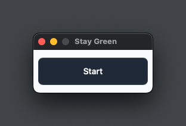

<h1>Stay Green</h1>
Keep your social app status as Available.

## How to

Install app from [Releases](https://github.com/5u4/stay-green/releases).

After clicking start, the program will move your cursor 1px every minute to keep your computer alive.
